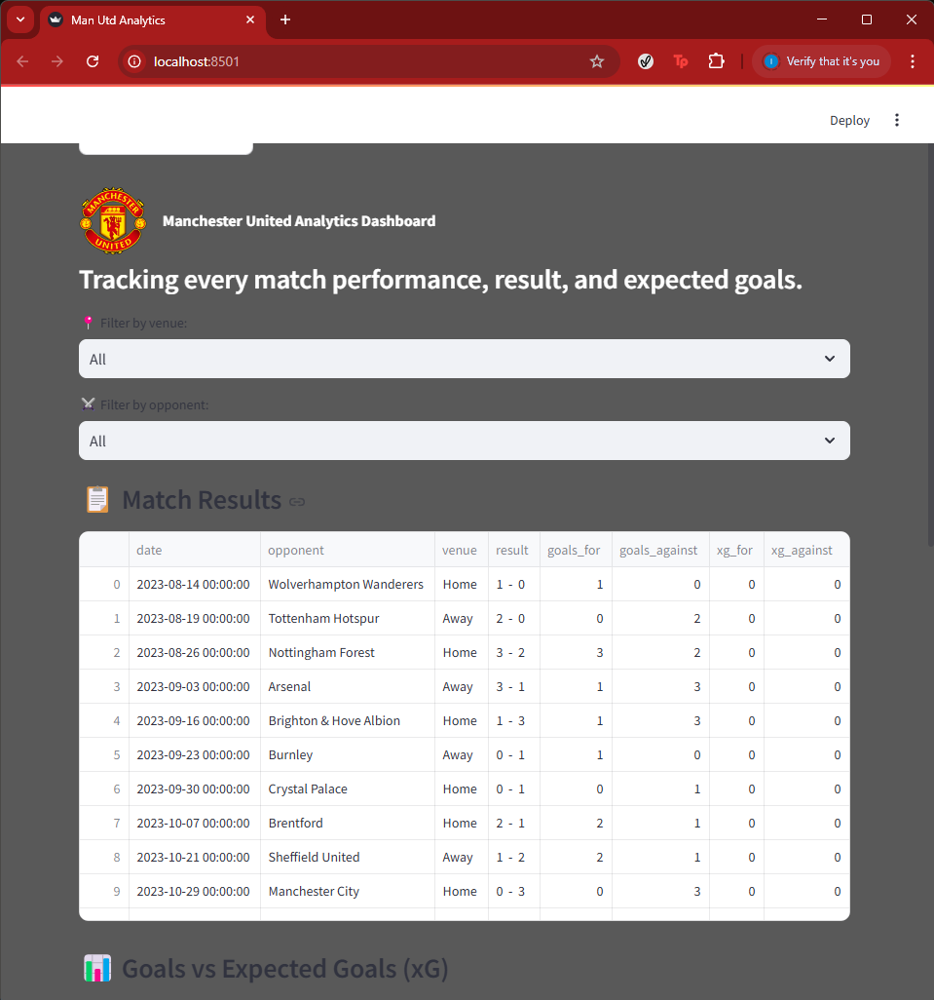

# 🔴 Manchester United Analytics Dashboard

This is a personal football analytics dashboard using real Premier League data from FotMob — focused entirely on Manchester United.

Built with Python, Streamlit, and SQLite, it lets you:

- Track United’s matches, goals, and xG
- View match trends across the season
- Filter by opponent or venue
- Refresh match data with 1 click
- Look cool doing it 😎

---

## 📸 Preview



---

## 🚀 How to Run Locally

### 1. Clone the project

```bash
git clone https://github.com/YOUR_USERNAME/united-analytics.git
cd united-analytics
